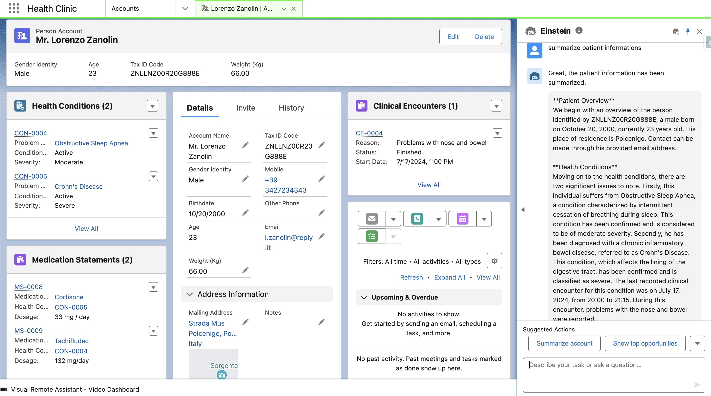
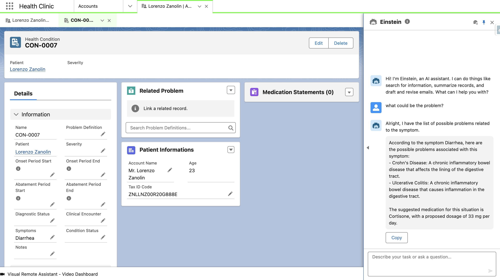
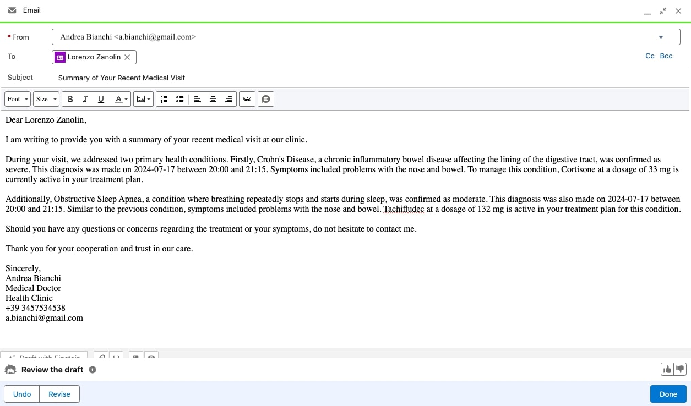

# Generative AI for Clinical Assistance
This project is my Master Thesis in AI & Cybersecurity. 
It explores the integration of generative AI into clinical workflows by modeling, creating, and integrating a database to support key tasks for healthcare professionals. The ultimate goal is to enhance efficiency and accuracy in clinical practice by leveraging AI capabilities. The work focuses on the following core functionalities:

1. **Patient Summary Generation**  
   Develop a system capable of producing concise and accurate summaries of a patient’s complete clinical history to streamline decision-making.

|  |
|:--:|
| <b>Summarize Patient task</b>|

2. **Medication Suggestion with Dosage Recommendations**  
   Implement a feature to provide tailored medication and dosage recommendations based on the patient's specific diagnoses and medical history.

|  |
|:--:|
| <b>List Possible Problems task</b>|

3. **Automated Referral Email Drafting**  
   Create a Copilot capable of generating detailed and professionally written referral emails summarizing all relevant information from medical consultations.

|  |
|:--:|
| <b>Send Visit Details task</b>|

## Evaluation Process

A rigorous evaluation framework is designed to assess the system’s performance through both quantitative metrics and qualitative feedback:

### Phase 1: Automatic Metrics  
The outputs generated by various generative AI models will be compared against physician-authored notes using standard natural language processing metrics, including:  
- **ROUGE**  
- **BLEU**  
- **METEOR**  
- **Word2Vec**  
- **BERTScore**  

### Phase 2: Expert Evaluation  
A panel of medical professionals will evaluate the AI outputs using the following criteria:  
- **Accuracy**  
- **Relevance**  
- **Coverage**  
- **Clarity**  

To ensure consistency, an inter-agreement index will be calculated to measure the consensus among evaluators.

### Phase 3: G-Eval Framework  
The evaluation process will be repeated using the **G-Eval** framework for a comprehensive analysis.

## Goals of the Project

This thesis aims to provide insights into the capabilities of generative AI in medical contexts, emphasizing the integration of AI systems into real-world clinical workflows and offering a robust evaluation methodology for assessing their effectiveness.
